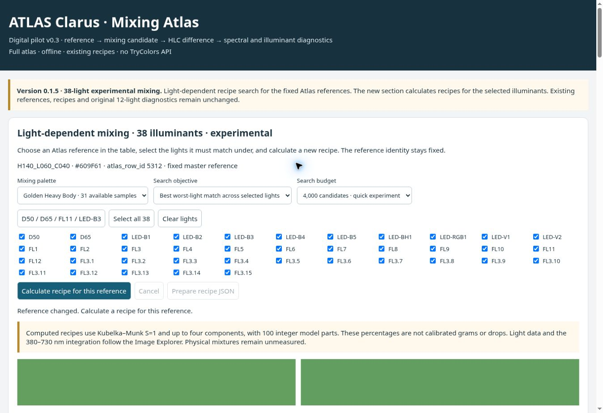

# Mixing Atlas 0.1.4 — live visual review, 5 October 2026

**Current status: UI-01 corrected and live verified in 0.1.5; mobile visual acceptance remains OPEN.**

The original 0.1.4 findings below are preserved as historical evidence. See the final follow-up section for the correction and live verification. No full desktop/mobile acceptance is claimed.

The requested live desktop views were inspected visually. The main controls and result presentation are usable, but a stale success message after a reference change is a confirmed UI finding. Mobile visual inspection could not be performed with the available browser controls. This report is evidence of the work performed, not a completed acceptance or a user sign-off.

## Identity and inspection environment

- Review date: 2026-10-05, Europe/Berlin. Performed interactively by the Codex agent through the graphical cloud Chrome browser; screenshots were actually inspected.
- Publication page: <https://arbe-lambda-star.com/atlas-clarus-mischatlas/> (WordPress page 5497).
- Direct live application and iframe source: <https://arbe-lambda-star.com/wp-content/plugins/atlas-clarus-mischatlas/assets/mischatlas.html?ver=0.1.4>.
- Observed application title: `ATLAS Clarus Mixing Atlas · 38-light experimental mixing · 0.1.4`; the visible release banner also identifies version 0.1.4.
- Desktop DOM viewport: 1363 × 936 CSS pixels, devicePixelRatio 1. The capture service supplied 1348 × 926 pixel JPEGs. The embedded iframe measured 1118 × 1098 CSS pixels. No mobile viewport or touch device was used.
- Browser version was not exposed by the available inspection surface. The publication page was viewed in the existing signed-in WordPress session, with its admin toolbar visible.
- Repository baseline inspected: `5fcb1062298257f8e1709f971d04abc85d452d61` (`main`). Latest commit touching `mischatlas/`: [8018735bb742f05d9a7bd8f3314ecd424ce73dbf](https://github.com/HelabHLC/atlas-clarus-connect/commit/8018735bb742f05d9a7bd8f3314ecd424ce73dbf).
- Published release: [atlas-mixing-v0.1.4](https://github.com/HelabHLC/atlas-clarus-connect/releases/tag/atlas-mixing-v0.1.4), target `53c0e5b3c0f47f0f2f58e80c8937849c066d76c2`. The live identity above is based on the rendered title, banner and iframe URL, not a fresh byte-for-byte comparison with the release asset.

## Existing automated evidence reused

[Mischatlas package run 37200103980](https://github.com/HelabHLC/atlas-clarus-connect/actions/runs/37200103980), for commit `8018735`, completed successfully on 2026-10-04. Its `validate` job `111429866413` records successful package build, PHP lint and `node mischatlas/light-mixing/browser-smoke.cjs` (step 7).

The checked-in [browser smoke test](../../mischatlas/light-mixing/browser-smoke.cjs) covers startup, real workers, 38-light search, reference changes, cancellation and downloaded JSON identity/conditions. Those automated tests were not rerun for this review. One small live 38-light calculation was performed to expose the rendered result state for visual inspection. Cancellation, imported-palette behaviour, numerical kernels and saved JSON bytes rely on the existing evidence and were not independently retested here.

The earlier [0.1.3 live record](../../mischatlas/LIVE_TEST_2026-10-02.md) remains historical. Its user-reported acceptance is not acceptance of the 0.1.4 feature. The graphical acceptance requirement in [0.1.4 release notes](../../mischatlas/RELEASE_NOTES_0.1.4.md) remains open.

## Desktop observations

| Area | Observed live behaviour | Result |
| --- | --- | --- |
| 38 lights | 38 distinct labelled checkboxes: D50/D65, nine LEDs, FL1–FL12 and FL3.1–FL3.15. Labels are readable and do not overlap in the inspected views. | PASS |
| Selection states | Initial checks are D50, D65, FL11 and LED-B3. Clear lights leaves zero checked; checking D50 leaves only D50; Select all 38 checks all 38. The starter preset was also used inside the WordPress iframe. | PASS |
| Reference display | Initial target `H140_L055_C040`, master HEX `#539154`, `atlas_row_id 5332`, visibly labelled fixed master reference. A later change displays `H140_L060_C040`, `#609F61`, row 5312. | PASS |
| Recipe area | Golden Heavy Body 31-sample subset, minimum worst-light objective, all 38 lights, 4,000-candidate budget. Completion and a four-component recipe are visible, with legible names and model-parts column. | PASS |
| Swatches | Initially two cards; after calculation three labelled cards: Fixed reference, Existing recipe, New light-dependent recipe. Visible D65/sRGB explanation remains separate from the numerical light comparison. | PASS |
| Comparison table | 38 rendered rows, all 38 selection marks after Select all. Existing/new columns are legible. The table scrolls through to FL3.15; the maximum-error summary is visible below. | PASS |
| JSON preparation | Prepare recipe JSON becomes enabled after calculation. It creates a persistent, visible, underlined link named `Download H140_L055_C040_LightDependent_Recipe_38SPD_v01.json` in Prepared downloads. Keyboard focus reaches this area. This review does not claim a newly verified saved file. | PASS, visible-link scope |
| WordPress embedding | Version banner, target, selectors, full light list and initial swatches are visible and usable inside the live iframe. Full result-state inspection was performed in the direct live view. | PASS, stated scope |
| Reference-change status | Recipe content clears, third swatch disappears and Prepare recipe JSON is disabled, but the previous completion message remains visible under the new target. | **FAIL — UI-01** |

Observed recipe for the first target: PB36:1 Cerulean Blue, Chromium 13; PY3 Hansa Yellow Light 51; PW6 Titan Buff 35; PY43 Raw Sienna 1. The UI reports 100 model parts, four components and 5,963 candidate evaluations. The displayed maximum across selected lights is existing 4.99 / new 4.25. These are recorded UI observations, not independently validated colour accuracy. The table explicitly shows that individual lights can be worse: D50 1.56 / 1.80; D65 1.25 / 2.90. The final FL3.15 row reads 1.27 / 2.69.

## UI-01 — stale completion message after changing reference

Reproduction on the direct live 0.1.4 page:

1. Leave target `H140_L055_C040` selected, choose Select all 38 and 4,000 candidates, then calculate and wait for completion.
2. Search `H140_L060_C040` in Reference or HEX and click the matching reference button.
3. Return to Light-dependent mixing.

Actual: the new target is `H140_L060_C040 · #609F61 · atlas_row_id 5312`; the new recipe is empty, the third swatch is gone and JSON preparation is disabled. Nevertheless, the status still says **“Recipe calculated for 38 illuminant(s). Compare its errors below.”**

Expected: once the reference changes, the status should clearly say that this target has no newly calculated light-dependent recipe, or the previous success message should be cleared. This is a misleading presentation state; the observation does not establish that the old numerical result is being used for the new target.

Source inspection is consistent with the observation: `lcReset()` calls `lcStop(message)`, but `lcStop()` only writes that message inside its `if (lcWorker)` branch. After a completed calculation no worker remains. No source fix was made in this review.

## Mobile — NOT TESTED

The available graphical browser API exposed no supported viewport-resize or device-emulation control. Browser keyboard attempts did not change the viewport or expose a usable device toolbar. A narrow screenshot crop would not test responsive layout, so no mobile PASS is inferred from desktop captures or the earlier automated test's screenshot calls.

To close this item, visually inspect the live publication page and direct app at a recorded portrait mobile viewport (for example 390 × 844 CSS pixels). Check all 38 labels and selection states, target address wrapping, the completed recipe, all three swatches, table scrolling and both comparison columns, and the full prepared JSON link. Record the actual browser/device, viewport, date and screenshots. After any UI-01 correction, inspect the changed-reference status in both layouts. A physical phone test must be identified separately from responsive emulation.

## Screenshot evidence and boundaries

All screenshots below are unedited captures from this session. File sizes, dimensions and SHA-256 values are recorded in [manifest.json](evidence/2026-10-05/manifest.json).

- [Initial desktop selection and fixed reference](evidence/2026-10-05/desktop-initial.jpg)
- [Completed recipe, three swatches and table columns](evidence/2026-10-05/desktop-swatches.jpg)
- [Table bottom and maximum-error summary](evidence/2026-10-05/desktop-table-bottom.jpg)
- [Visible prepared JSON link](evidence/2026-10-05/desktop-download.jpg)
- [WordPress embedded initial controls](evidence/2026-10-05/desktop-embedded.jpg)
- [Reference change with stale success status](evidence/2026-10-05/desktop-reference-change.jpg)

This documentation change adds only the review and its screenshot evidence under `docs/`. It changes no numerical data, reference spectra, recipes, mixing algorithms, application source, release assets or live WordPress content. It does not establish physical mixing accuracy or production approval. Full visual acceptance must remain open until UI-01 is resolved and mobile visual evidence is added.

## Follow-up — UI-01 corrected and live verified in 0.1.5

On 2026-10-05, [PR #62](https://github.com/HelabHLC/atlas-clarus-connect/pull/62) was merged as `f94e08e009a8dcffe02085a24f38b2a310387f7c` and published as [atlas-mixing-v0.1.5](https://github.com/HelabHLC/atlas-clarus-connect/releases/tag/atlas-mixing-v0.1.5).

The fix moves status-message updates outside the active-worker condition and gives reference changes a clear request to calculate a new recipe. A targeted regression fails against the old code and passes against the fix for both completed and running searches. [Chromium/package run 37349251308](https://github.com/HelabHLC/atlas-clarus-connect/actions/runs/37349251308) passed with new assertions for the status text, cleared recipe and two remaining swatches. The build reports all 13,283 original reference/recipe records unchanged. Numerical data, spectra, mixing kernels and search algorithms were not modified.

Before installation, the downloaded ZIP SHA-256 (`e2784e966441f8735b4b957ecb164d2262a636b87b1e54b62f93bd02378a751b`), ZIP CRC, complete package manifest and HTML SHA-256 (`6134657042cac978b5bf5a81be3e881cf2fbd27f5df52d990fab63b16d4c1fda`) were verified locally. WordPress's normal plugin upload replaced 0.1.4 with 0.1.5 and reported success; a separate plugin read confirmed version 0.1.5 active. Page 5497's version labels and download URLs were updated. The live iframe now points to `mischatlas.html?ver=0.1.5`.

A fresh interactive check on <https://arbe-lambda-star.com/wp-content/plugins/atlas-clarus-mischatlas/assets/mischatlas.html?ver=0.1.5> repeated the exact completed-search reproduction: H140_L055_C040, all 38 lights, 4,000 candidates, then select H140_L060_C040. The first calculation displayed the same observed 13/51/35/1 model-parts recipe and 5,963 evaluations as before. After the reference change, the target showed H140_L060_C040 / #609F61 / row 5312, status read **“Reference changed. Calculate a recipe for this reference.”**, the recipe was empty, JSON preparation disabled and only Fixed reference / Existing recipe swatches remained.

**UI-01: RESOLVED — live desktop verification PASS.** The original failure screenshot above remains historical. Mobile live visual inspection remains NOT TESTED for the previously recorded browser limitation; this follow-up does not claim full desktop/mobile acceptance.

